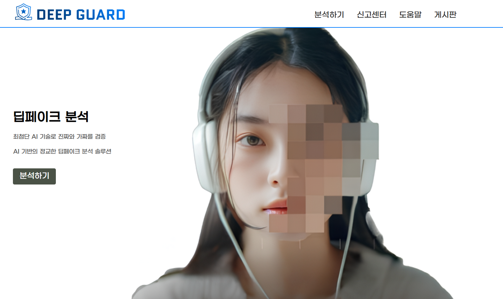
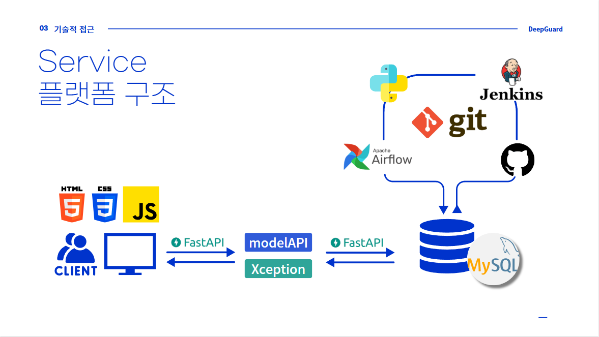
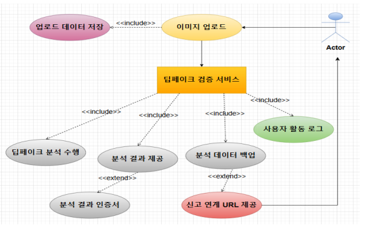
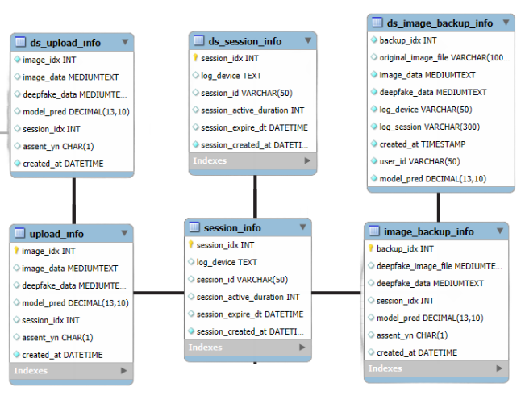
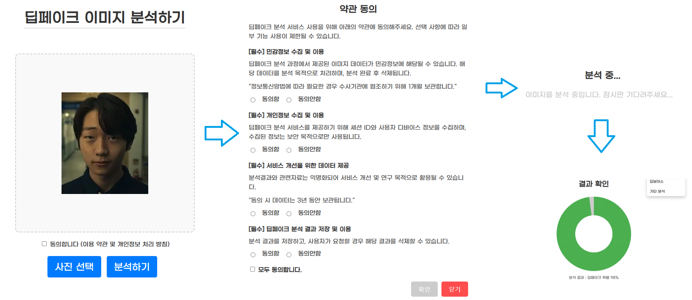
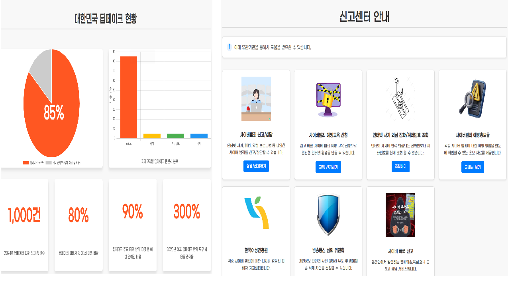
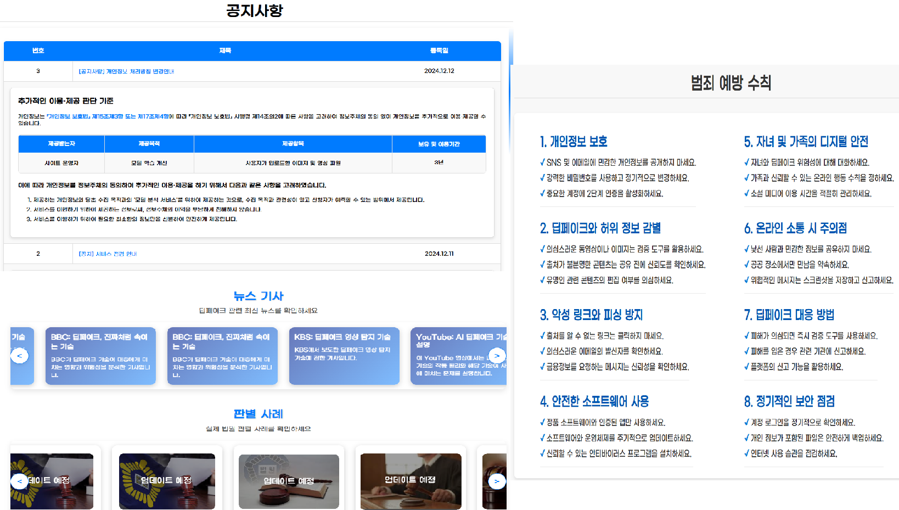
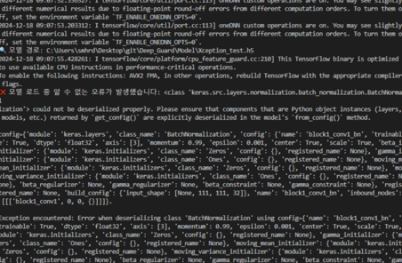
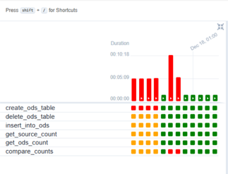

# 딥페이크 탐지 모델 프로젝트
https://github.com/Gwang-ju-ShinKang/Deep_Guard

# 📎 딥페이크 이미지 분석할래?(팀명: 딥가드)

## 👀 서비스 소개
* 서비스명:  딥러닝 모델을 활용한 딥페이크 분석 서비스
* 서비스설명: 딥러닝 모델을 활용하여 실시간으로 딥페이크 여부를 판단하고
  사용자에게 분석 결과를 제공하는 서비스입니다. 
 

## 📅 프로젝트 기간
2024.11.04 ~ 2024.12.26 (8주)
 

## ⭐ 주요 기능
* 이미지 분석 기능
* 음성 분석 기능
* 분석 결과 PDF 저장 기능
* 유관기관 연결 URL
 

## ⛏ 기술스택
<table>
    <tr>
        <th>구분</th>
        <th>내용</th>
    </tr>
    <tr>
        <td>사용언어</td>
        <td>
             
            
            
            
        </td>
    </tr>
    <tr>
        <td>개발도구</td>
        <td>
            
            
        </td>
    </tr>
    <tr>
        <td>서버환경</td>
        <td>
            
        </td>
    </tr>
    <tr>
        <td>데이터베이스</td>
        <td>
            
        </td>
    </tr>
    <tr>
        <td>협업도구</td>
        <td>
            
            
        </td>
    </tr>
</table>

 

## ⚙ 시스템 아키텍처(구조) 예시 

 

## 📌 SW유스케이스

 

## 📌 ER다이어그램

 

## 🖥 화면 구성

### 이미지 분석

 

### 딥페이크 현황 및 신고센터

 

### 공지사항, 범죄 예방 수칙, 딥페이크 기사 및 판결

 

## 👨‍👩‍👦‍👦 팀원 역할
<table>
  <tr>
    <td align="center"></td>
    <td align="center"></td>
    <td align="center"></td>
    <td align="center"></td>
    <td align="center"></td>
  </tr>
  <tr>
    <td align="center"><strong>신강</strong></td>
    <td align="center"><strong>이우영</strong></td>
    <td align="center"><strong>유승원</strong></td>
    <td align="center"><strong>김강민</strong></td>
    <td align="center"><strong>김정현</strong></td>
  </tr>
  <tr>
    <td align="center"><b>팀장 DB</b></td>
    <td align="center"><b>부팀장 Modeling</b></td>
    <td align="center"><b>Backend</b></td>
    <td align="center"><b>발표</b></td>
    <td align="center"><b>FrontEnd</b></td>
  </tr>
  <tr>
    <td align="center"><a href="https://github.com/자신의username작성해주세요" target='_blank'>github</a></td>
    <td align="center"><a href="https://github.com/leWYoung/test" target='_blank'>github</a></td>
    <td align="center"><a href="https://github.com/자신의username작성해주세요" target='_blank'>github</a></td>
    <td align="center"><a href="https://github.com/자신의username작성해주세요" target='_blank'>github</a></td>
    <td align="center"><a href="https://github.com/자신의username작성해주세요" target='_blank'>github</a></td>
  </tr>
</table>

## 🤾‍♂️ 트러블슈팅
* 문제1 

 - 모델 로드 과정에서 버전 차이로 인한 문제 발생
 - 모델의 가중치와 아키텍처를 분리해서 로드 후 문제 해결
 
* 문제2 

 - 반환 결과를 제대로 받아오지 못하는 문제 발생
 - 튜플 형태를 반영 이차원 배열을 사용하여 정확한 값에 접근하도록 함
